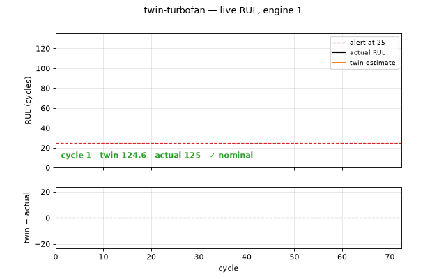
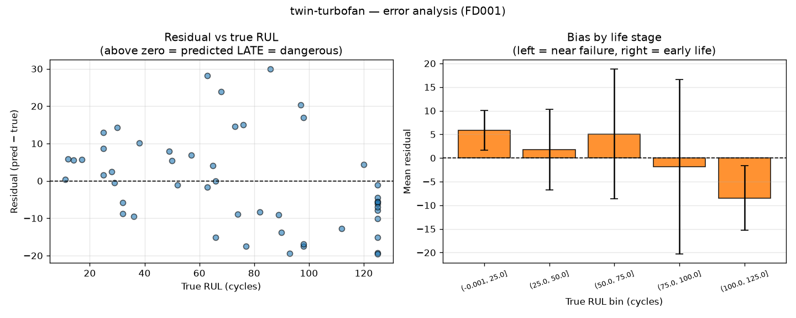
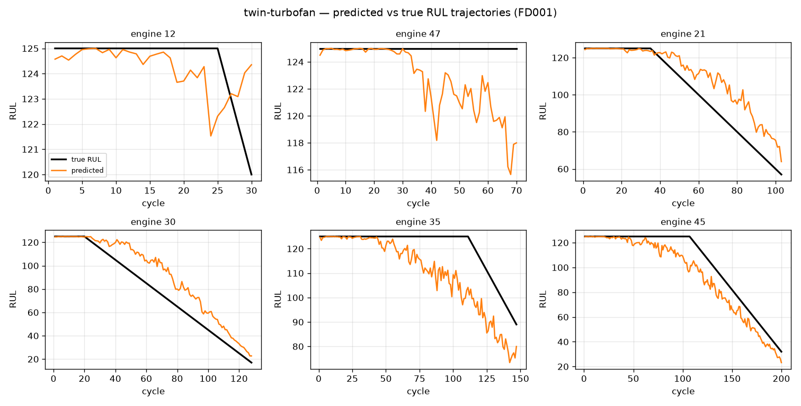

# twin-turbofan

A **digital twin of a jet engine** for predictive maintenance. It ingests engine sensor
telemetry, mirrors the engine's health state, and predicts **Remaining Useful Life
(RUL)** — how many operating cycles remain before service is needed.

Part of the `twin-*` portfolio. This one is the *predictive-maintenance* archetype of a
digital twin: a model continuously updated by sensor data and used to forecast a
physical asset's future.

> ### ⚠️ Read the results caveat first
> Every number in this README was produced on the **synthetic fallback dataset**, not
> the real NASA C-MAPSS data. The synthetic generator emits smooth monotonic drift with
> no real fault modes, so these figures demonstrate that the pipeline is correct — they
> are **not benchmark results** and are not comparable to published C-MAPSS numbers.
> Drop the real data into `data/CMAPSSData/` (see [`data/README.md`](data/README.md)) and
> `make all` regenerates everything. Sections below say so where it matters.
>
> **Generator v2 (this run).** The generator used to give its "constant" sensors σ=0.5
> noise, so `select_informative_sensors` dropped 0 of 21 sensors here where real FD001
> drops 6. v2 emits those six as exact constants: the fallback now drops **6 of 21** and
> builds 45 feature columns instead of 63, like the real data. That moved the baseline
> from RMSE 10.309 / PHM 85.0 to **12.513 / 115.4**, and **invalidates every synthetic
> number recorded before it**. The baseline and error analysis below are v2; the model
> comparison, ablation, sweep, variance, uncertainty and ensemble tables are still v1 and
> are *not* comparable to them. Full accounting, including which 9% of that shift is the
> fix and which 91% is a different random draw:
> [`outputs/synthetic_fidelity.md`](outputs/synthetic_fidelity.md).

---

## Why this is a real digital twin

A digital twin isn't just a trained model — it's a model kept **in sync with a physical
asset** and used to reason about it. The defining loop:

```
   ┌─────────────────┐     telemetry      ┌──────────────────────┐
   │  Physical asset │  ───────────────▶  │      Digital twin    │
   │  (jet engine)   │   21 sensors /     │  feature pipeline +  │
   │                 │   3 settings /     │  RUL model           │
   │  ── or ──       │   per cycle        │                      │
   │  C-MAPSS replay │                    │  state estimate      │
   └─────────────────┘                    │  + RUL forecast      │
            ▲                             └──────────┬───────────┘
            │                                        │
            │        alerts / maintenance            ▼
            └──────────────────────────  Dashboard: RUL ticking down,
                                          twin vs. actual divergence
```

The twin consumes telemetry **one cycle at a time** and builds its features
incrementally using statistics frozen at training time — see
[Design decisions](#design-decisions) for why that detail is the difference between a
digital twin and a batch script with a live-looking chart.



Engine 48 replayed cycle by cycle. The twin tracks the true RUL down and crosses the
25-cycle alert threshold at **cycle 163**, two cycles before the true countdown reaches
it — early, which is the safe direction. The lower panel is twin − actual.

The GIF is generated by `python -m src.make_demo_gif --unit 48` from the twin's actual
output, not screen-recorded, so it cannot drift out of sync with the model. The same
replay through the Streamlit dashboard and through `telemetry simulate` produces
identical numbers (alert at cycle 163, final estimate 11.3 vs actual 11) — all three
surfaces share one online feature path.

---

## Quickstart

```bash
make setup     # native arm64 venv (py3.11) + dependencies incl. torch
make data      # synthetic C-MAPSS-shaped data, so this runs with zero downloads
make all       # baseline, error analysis, ablation, uncertainty, comparison, GIF
make test      # fast suite (242 tests)
make test-all  # + the 5 slow model-training tests
make check     # ruff + mypy + doc-number check + pytest
```

Or without `make`:

```bash
pip install -r requirements.txt
python -m src.generate_synthetic
python -m src.train_baseline
python -m src.error_analysis
```

The live twin, no broker required:

```bash
python -m src.telemetry simulate --unit 48
```

Over a real MQTT bus (needs a broker, e.g. `brew install mosquitto`), in two terminals:

```bash
python -m src.telemetry twin
python -m src.telemetry publish --unit 48 --delay 0.05
```

The Streamlit dashboard — note `app.py`, **not** `src/dashboard.py`:

```bash
streamlit run app.py
```

> The core pipeline needs only numpy/pandas/matplotlib. `scikit-learn` enables the
> RandomForest baseline; `torch`, `streamlit` and `paho-mqtt` are optional extras behind
> clean imports, and their tests skip themselves when absent.
>
> That claim is **verified, not asserted** — `make check-minimal` hides the extras and runs
> the suite plus the pipeline against them. Measured: **242 passed** with everything
> installed, **168 passed + 2 module-skips** without, and the baseline and live twin produce
> byte-identical results either way (RMSE 12.513, alert at cycle 163). CI runs the same
> check as a separate torch-free job.

---

## Results

**All numbers below are on synthetic data — see the caveat at the top.** Data
vintage: the baseline and error analysis are generator **v2**; the model
comparison, ablation, sweep, variance, uncertainty and ensemble tables are
still **v1** and are not comparable to the v2 baseline.

### Model comparison — FD001

Sequence models use the sweep-selected configuration (`seq_len=50, hidden=128, lr=3e-4`),
80 epochs, early stopping patience 10, best-validation checkpoint restored.

Each architecture uses the configuration selected on **seed-averaged** validation, with
results averaged over **5 seeds**. Cells are `mean ±95% CI` (Student-t on the mean, t=2.776
at df=4) — not the half-range this table used at 3 seeds. Single-seed numbers appear only as
detail rows — see the caveat below.

| model | config | RMSE ↓ | PHM ↓ | across-seed range | params |
|---|---|---|---|---|---|
| **GRU** | 50/128/1e-3 | **2.985** ±0.941 | **10.9** ±3.4 | 1.920 | 170,433 |
| LSTM | 50/128/3e-3 | 4.122 ±0.431 | 16.7 ±2.5 | 0.815 | 225,857 |
| ATTENTION | 50/128/3e-4 | 4.435 ±2.568 | 24.0 ±28.6 | 5.083 | 187,074 |
| CNN | 30/32/1e-3 | 9.304 ±0.916 | 63.1 ±18.7 | 2.000 | 8,673 |
| RandomForest | — | 12.645 ±0.105 | 118.4 ±2.5 | **0.231** | — |

**GRU, LSTM and ATTENTION are indistinguishable at 95% CI** — their intervals all overlap, so
the top three rows are a tie, not a ranking. CNN and RandomForest are cleanly separated from
everything else. See `outputs/comparison.md` §"Statistical separation" for the pairwise verdicts.

**The GRU leads on the mean of both metrics** — 76% better RMSE and 91% better PHM than the
forest. It only got there after the configuration selection was itself corrected: its single-seed
sweep picked `lr=3e-4`, the seed-averaged ranking prefers `lr=1e-3`, and that is worth 0.36 RMSE.

**But the lead over the LSTM is not statistically resolved.**
The GRU leads the LSTM by 1.137 RMSE
against across-seed ranges of 1.92 and 0.815, and their 95% confidence intervals overlap.
Five seeds narrowed the intervals enough to separate GRU/LSTM/ATTENTION from CNN and the forest,
and *not* enough to separate the three from each other. "Ahead on the mean, tied on the
evidence" is the honest phrasing — and note that overlapping intervals are a conservative test,
so this is an unresolved question rather than a demonstrated equality.

**`attention` is the least stable model by a wide margin**, and that is its defining property
here. At its own best configuration it varies by **2.393** validation RMSE across seeds, and its
comparison-table interval (±2.568) is six times the LSTM's (±0.431) — the widest of any model,
and the reason it cannot be separated from anything despite a worse mean.

(It was for a while the only architecture never swept, running on shared defaults while the
others used their own grids. Sweeping it resolved that in the dull direction: its swept optimum
is 50/128/3e-4 — exactly the default it already had. The row was fair by luck.)

**The RandomForest still owns reliability**, and that is the finding with the most practical
weight. Its across-seed range is **0.231** against 0.8–5.1 for every neural model — 4× to 22×
tighter — and it was the only model whose seed-42 result was *unfavourable*. For a model that gets
retrained periodically, landing in the same place every time is worth a great deal. It is also
the only model here whose 95% interval (±0.105) is narrow enough that a single extra seed would
not move it.

> **How much of this project's history was seed noise.** Seed 42 was fixed early and reused, and
> it flattered every neural model by 0.5–2.0 RMSE. Chasing that down retracted a GRU-beats-LSTM
> claim, retracted a CNN "efficiency win", and then showed the *configuration selection* those
> claims rested on was also single-seed — which cost the GRU 1.49 RMSE. Details in
> [`docs/benchmarks.md`](docs/benchmarks.md) §4c, §5, §8c and `worklog.md`.

### Error analysis



The aggregate mean residual is ≈0 (**−0.46** cycles), so the model is not systematically
late. The PHM score is instead driven by a **tail**:

| | share of total PHM |
|---|---|
| worst single engine (true 86 → predicted 116) | 16.4% |
| worst 6 engines | 51% |
| all late predictions (44% of the fleet) | 68% |

Where the error sits is *not* operationally favourable on this data: the worst misses are
mid-life engines, but near failure (RUL 0–25) the twin now runs **late** by +5.81 cycles
on average — the dangerous direction, in the regime where the maintenance decision is
actually made. On the v1 generator the same bin was −1.53 (early); the flip came with the
regenerated data, not with a model change. See
[`outputs/synthetic_fidelity.md`](outputs/synthetic_fidelity.md).



### Feature ablation

| arm | features | RMSE | PHM |
|---|---|---|---|
| raw sensors only | 21 | 10.574 | 84.4 |
| **+ rolling w=3** | 63 | **10.249** | **79.0** |
| + rolling w=5 *(default)* | 63 | 10.309 | 85.0 |
| + rolling w=10 | 63 | 10.555 | 100.3 |
| + rolling w=20 | 63 | 11.489 | 128.3 |

Rolling features buy only ~3% RMSE for 3× the feature count, and the shipped default
`w=5` is *not* optimal — `w=3` beats it on both metrics. The default is deliberately
left alone: tuning it on synthetic data would fit an artefact of the generator. Long
windows are actively harmful, because a 20-cycle mean lags a monotonic trend and
understates current degradation.

### The attention model: best number, worse engineering choice

At seed 42 `AttentionRegressor` is the best result here — **RMSE 6.248 / PHM 31.0** versus the
GRU's 7.292 / 44.9. It does not survive a variance check, and what replaces it is more useful:

| arch | seed 42 | seed-mean | RMSE spread | PHM std |
|---|---|---|---|---|
| attention | **6.248** | 8.210 | **5.733** | 32.5 |
| GRU | 7.292 | 8.312 | 1.767 | 10.6 |

The means are indistinguishable, so the 14% win is not architectural. But attention is **3.2×
less stable across seeds** — seed 42 flatters it by 1.96 RMSE against its own average, versus
1.02 for the GRU, and its PHM range spans 31.0 to 100.6. For a maintenance model that is a
liability: a best case you cannot reliably reproduce is worth less than a slightly worse one you
can. On the seed-averaged table the **LSTM** has both the best PHM and a spread a quarter of
attention's, which makes it the most defensible sequence model of the three — though even that
lead is inside the noise. The attention model earns its place for interpretability, which is why
it was added.

### Does blending help? No.

Ensembling the RandomForest with the GRU, weight chosen on held-out validation engines:
validation prefers more GRU monotonically and selects **w=1.0** — the sequence model alone.

The instructive part is that *test* disagrees: `w=0.8` scores 7.132 RMSE / 42.3 PHM, beating
the GRU alone on both. Had the weight been picked on test, this section would claim a 2% RMSE
and 6% PHM win from ensembling. With 50 test engines and eleven weights on offer, something
always beats both endpoints — and validation/test disagreeing about the optimum is precisely
the evidence that the apparent gain is selection noise. That is why the weight is chosen on
validation.

### Uncertainty — a hypothesis that mostly failed

The error analysis showed PHM is tail-driven, which suggested that shifting every
prediction earlier should cheaply buy a large PHM reduction. Split-conformal calibration
(30 held-out engines) says otherwise:

| residual quantile | offset | RMSE | PHM |
|---|---|---|---|
| 0.50 | −0.55 | 10.540 | 84.4 |
| 0.60 | −0.02 | 10.518 | 82.1 |
| **0.70** | **+1.86** | 10.654 | **77.5** |
| 0.80 | +6.78 | 12.428 | 87.2 |
| 0.90 | +16.11 | 19.041 | 182.4 |

The curve is U-shaped with a **shallow** minimum: the best shift recovers **5.6% of PHM
for a 1.3% RMSE cost**. Real, favourable, and far smaller than "71% of the score is late
predictions" implied. Tail concentration does not mean a *uniform* offset helps — the PHM
asymmetry (`exp(d/10)` late vs `exp(-d/13)` early) is only mildly lopsided, so moving all
50 engines earlier pays a small penalty on every one to shave a few large errors.
Attacking the tail needs **per-engine** conservatism scaled to each engine's own
uncertainty — which, tested separately, **does** work:

| approach | best PHM | vs unadjusted |
|---|---|---|
| unadjusted point prediction | 82.1 | — |
| best global offset | 77.5 | −5.6% |
| **per-engine, k·sigma (k=0.25)** | **74.4** | **−9.4%** |

Per-engine also beats a uniform shift of the *same* mean amount (2.2 cycles) by 2.8 PHM, so
the improvement comes from **allocation**, not from being more conservative. The
precondition is measured, not assumed: the forest's per-tree spread correlates **+0.546**
with absolute error. The gain is confined to mild `k` — sigma reaches ~16 cycles, so larger
`k` over-corrects and the early-penalty term takes over. See
[`docs/benchmarks.md`](docs/benchmarks.md) §6b.

Conformal interval coverage, for reference — slightly over-covering, as expected given
that calibration sees every cycle while the test set observes one truncated point per
engine:

| nominal | empirical | mean width |
|---|---|---|
| 80% | 84.0% | 30.0 cycles |
| 90% | 92.0% | 39.4 cycles |
| 95% | 98.0% | 45.7 cycles |

### For reference: published FD001 results

Published baselines on **real** FD001 land roughly in the high-teens to low-30s RMSE;
sequence models push into the ~12–16 range. Our synthetic numbers look better than that
only because the synthetic degradation is far easier than real engine wear — which is
exactly why they are not a benchmark.

---

## Design decisions

**Report both RMSE and the PHM score, always.** In maintenance, a late prediction means
the part failed in service; an early one means you serviced it sooner than needed. RMSE
treats those identically, the PHM score doesn't. They genuinely disagree here — swapping
the ridge fallback for the RandomForest improved RMSE (11.07 → 10.31) while making PHM
*worse* (79.2 → 85.0).

**Split by engine, never by cycle.** Consecutive cycles from one engine are
near-duplicates. A random row split leaks the target into validation and every metric
becomes optimistic fiction.

**Score on each engine's last cycle.** That is the operational decision point, and it is
what the C-MAPSS `RUL_*.txt` files define. Applied identically to the tree model and the
sequence models, so the two families are comparable.

**Validate sequence models over all windows, not last cycles.** Training engines run to
failure, so a held-out engine's final cycle always has RUL = 0. Early stopping on that
single degenerate point would mirror nothing about the truncated test set.

**Select hyperparameters on validation, never test.** `src/sweep.py` ranks by validation
RMSE and prints the best test number only as a sanity check.

**The live twin builds features incrementally, with training statistics.** The original
streaming demo called `build_xy` over the entire test set up front — correct numbers, but
it depended on data from the future and would break on real telemetry.
`src/online.py` persists the fitted feature contract (`FeatureSpec`) at training time and
rebuilds features one reading at a time. Recomputing standardisation from live data is
the classic train/serve skew bug: no error, no crash, just quietly wrong predictions. A
test asserts the streaming path reproduces the batch path to 1e-9.

**Mid-life divergence is a label artefact, not model error.** The piecewise-linear cap
holds the target flat at 125 while the model reports continuous degradation, so the twin
looks pessimistic long before the true countdown starts.

---

## How it works

| Stage | File | What it does |
|-------|------|--------------|
| Data | `src/data_loader.py` | Loads C-MAPSS, builds the piecewise-linear RUL target (capped at 125) |
| Data (fallback) | `src/generate_synthetic.py` | FD001-format synthetic data so the pipeline runs offline |
| Features | `src/features.py` | Drops constant sensors, adds rolling mean/std per engine, standardises on train stats |
| Features (online) | `src/online.py` | `FeatureSpec` + `OnlineFeatureBuilder` — incremental features for the live twin |
| Baseline | `src/train_baseline.py` | RandomForest RUL regressor; writes the model and its feature spec |
| Sequence models | `src/seq_models.py` | LSTM, GRU, 1D-CNN behind one `(B,T,F) → (B,)` contract |
| Training harness | `src/train_seq.py` | By-engine split, MPS/CUDA/CPU, seeding, early stopping, last-cycle scoring |
| Experiments | `src/ablation.py`, `src/sweep.py`, `src/compare.py` | Feature ablation, hyperparameter sweep, model×dataset table |
| Uncertainty | `src/uncertainty.py`, `src/uncertainty_per_engine.py` | Conformal intervals; global vs per-engine conservatism |
| Ensemble | `src/ensemble.py` | RF + sequence blend, weight chosen on validation |
| Config | `src/config.py`, `config.yaml` | Layered settings (defaults < YAML < `TWIN_CONFIG` < CLI) + logging |
| Metrics | `src/evaluate.py` | RMSE + the asymmetric PHM challenge score |
| Error analysis | `src/error_analysis.py` | Per-engine trajectories, residual-vs-RUL, bias by life stage |
| Live twin | `src/telemetry.py` | MQTT publisher + subscriber, plus a broker-free `simulate` mode |
| Dashboard | `src/dashboard.py`, `app.py` | Streamlit live view over the online feature path |
| Demo | `src/make_demo_gif.py` | Renders `docs/demo.gif` from the twin's real output |

---

## Testing

**247 tests** — 242 in the default run (seconds), plus 5 marked `slow` that train models
end-to-end and are excluded by default so the inner loop stays fast; CI runs everything.
Coverage **75%**, core library modules 91–100%. They lean
on properties rather than golden values: RUL labelling under both the train and test
conventions, `phm_score` asymmetry (parametrised over error magnitudes), NaN and leakage
guards, window boundaries, and batch/stream feature parity. Entry-point scripts get
smoke tests that assert they run and emit their artifacts — which is how a real bug in
`FeatureSpec.save()` was caught, where the output path was bound as a default argument
and so ignored any redirect.

The suite was **mutation-tested** — the source was deliberately broken 13 ways and each
break confirmed to fail a test. One survivor was informative: replacing the CNN's
time-pooling with "read only the first timestep" is shape-identical, so every shape
assertion passed. That gap is now covered by a test asserting the prediction responds to
a mid-window perturbation.

```bash
make check   # ruff + mypy + doc-number check + pytest
```

### The numbers in this README are checked, not trusted

Every headline figure above was copied by hand out of `outputs/`. Re-run a sweep and the
artifact moves while the prose keeps quoting the old value — silently, because nothing
crashes and the table still looks authoritative.

`src/validate_docs.py` re-derives them instead. It reads the JSON artifacts, recomputes
each quoted number, and reports any disagreement with a `file:line` and expected-vs-actual:

```bash
make check-docs
```

**337 numbers across 92 specs** at the last run. It found a real one on its first pass:
this table listed the CNN at **10,401 parameters**, the count for the `20/32` configuration
the single-seed sweep used to pick, while the config column had already moved to the
seed-averaged `20/64` — 26,881 parameters. Three across-seed ranges were also truncated
rather than rounded (2.672 for 2.673).

Anything number-bearing in `outputs/` that no check reads is reported too, so a new
experiment cannot quietly add unguarded numbers to these pages. Note that `outputs/*.json`
is gitignored: from a bare checkout the check skips the specs whose artifacts are absent
and says how many, rather than failing.

---

## Layout

```
twin-turbofan/
├── README.md
├── TODO.md / worklog.md         # backlog + timestamped run log
├── Makefile / Dockerfile / pyproject.toml
├── config.yaml                  # experiment settings in one auditable place
├── app.py                       # streamlit entry point
├── scripts/
│   ├── fix_venv.py              # repoint .venv/bin after moving the repo
│   └── no_optional_deps/        # hides torch/streamlit/paho for `make check-minimal`
├── .github/workflows/ci.yml     # lint, tests with and without torch
├── conftest.py
├── data/README.md               # how to get C-MAPSS + schema
├── outputs/                     # metrics, reports, figures
├── src/
│   ├── data_loader.py  features.py  online.py  evaluate.py  models.py
│   ├── config.py  paths.py
│   ├── train_baseline.py  seq_models.py  train_seq.py  model_lstm.py
│   ├── ablation.py  sweep.py  compare.py  ensemble.py  error_analysis.py
│   ├── uncertainty.py  uncertainty_per_engine.py
│   ├── telemetry.py  dashboard.py  stream_demo.py  make_demo_gif.py
│   └── generate_synthetic.py
└── tests/
```

## Limitations

- **The headline limitation: no real data.** Everything above is synthetic. Model
  ranking, the ablation's window choice, and the conformal offsets could all change on
  real C-MAPSS.
- Only FD001 exists synthetically, so the model×dataset comparison is one column of
  four, and cross-condition generalisation (FD001 → FD002/FD004) is untested.
- ~~`select_informative_sensors` drops 0 of 21 sensors on synthetic data.~~ **Fixed** —
  generator v2 emits FD001's six flat sensors as exact constants, so the fallback drops
  **6 of 21** and the drop path now runs on every synthetic run, not only in unit tests.
  The cost is that it invalidated the v1 synthetic numbers: see
  [`outputs/synthetic_fidelity.md`](outputs/synthetic_fidelity.md), and note that the
  comparison, ablation, sweep, variance, uncertainty and ensemble tables above have not
  been regenerated on v2 — they need sequence-model reruns.
- **Five seeds still do not separate the top three models.**
  The GRU leads the LSTM by 1.137 RMSE
  against across-seed ranges of 1.92 and 0.815, and the GRU, LSTM and ATTENTION 95%
  intervals all overlap. Raising 3 → 5 seeds did settle the bottom of the table (CNN and the
  forest are now cleanly separated); settling the top would need more seeds, and the interval
  only tightens as ~1/√n, so the next meaningful step is closer to 10–20 than to 7.
- Sweeps are ranked on a single seed. `src/rerank.py` re-checks the *finalists* across seeds
  and caught two bad selections, but a fully seed-averaged sweep (seeds × 27 configs × 4
  architectures) was out of budget.
- The winning sweep cell sits on the grid boundary, so capacity may be unsaturated. Extending
  the grid is not obviously worthwhile: the across-seed spread already exceeds the gaps a
  wider single-seed grid would rank.
- `select_informative_sensors` is only wired to `config.yaml`'s `variance_threshold` at the
  default value; the ablation and sweep scripts still take their own CLI defaults rather
  than reading the config.
